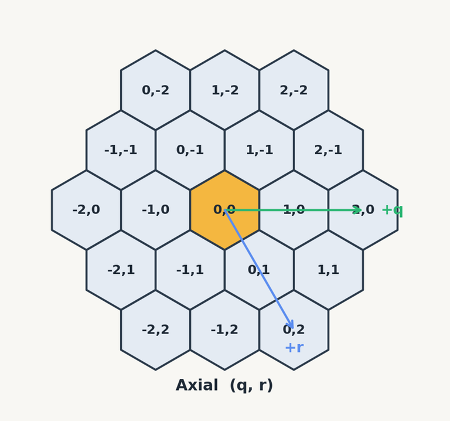

<p align="center">
  
</p>

# Paradigmas de Programación

## TP1 — Hive

## Introducción

[Hive](<https://en.wikipedia.org/wiki/Hive_(game)>) es un juego de tablero sin tablero: las
piezas son insectos y el "tablero" es la figura que forman las piezas ya colocadas.
Cada jugador coloca sus piezas y las mueve alrededor de esa figura, y gana quien
logre rodear por completo a la reina del otro.

Los casilleros se nombran con **coordenadas axiales** `(q, r)`. En una grilla de
cuadrados alcanzan una fila y una columna perpendiculares, pero en una de
hexágonos cada fila va corrida media pieza respecto de la de arriba, así que se
usan dos ejes que no forman 90 grados: `q` crece hacia la derecha y `r` hacia
abajo a la derecha. El origen `(0, 0)` es donde cae la primera pieza de la
partida, y de ahí para afuera hay coordenadas negativas en las dos direcciones.

Con esos dos ejes, los 6 vecinos de `(q, r)` son `(q+1, r)`, `(q-1, r)`,
`(q, r+1)`, `(q, r-1)`, `(q+1, r-1)` y `(q-1, r+1)`. Ojo con `(q+1, r+1)`, que
parece vecino y está a dos pasos. Estas son las coordenadas que van a ver en los
tests y en `Hex`, y las que necesitan para armar un tablero a mano.

<p align="center">
  
</p>

Todas las piezas se mueven distinto —la reina un paso, el saltamontes salta en
línea recta, el escarabajo se sube arriba de las demás— pero el resto del juego
las trata a todas igual: alguien pregunta "¿a dónde puede ir esta pieza?" y espera
una lista de destinos. Ese contraste es el tema del TP.

En este repositorio ya están implementados el tablero, las reglas generales del
juego y la interfaz gráfica. Falta la parte que hace que cada pieza sea distinta,
y la que conecta el tablero con un algoritmo genérico de grafos. **Los headers
(`include/hive/`) son el contrato**: están documentados método por método, y decir
qué tiene que hacer cada uno es trabajo de ellos, no de este enunciado.

## Integrantes

Este TP se hace de a 2 personas. Ni más ni menos. Recuerden completar el
formulario para que les asignemos los grupos.

Aquellos que estén solos les vamos a asignar un grupo al azar.

## Consigna

El TP tiene tres partes. Cada una tiene sus propios tests y se puede entregar
funcionando por separado; les conviene hacerlas en orden, porque la 2 sigue lo
que empieza la 1b, y la 3 usa lo de la 2.

---

### Parte 1 — El jugador y la pieza más simple

La parte 1 son dos ejercicios chicos e independientes, uno por cada mitad del TP
que viene después: el estado de un objeto (1a) y la primera estrategia de
movimiento (1b). Cada uno tiene sus propios tests.

#### Parte 1a — La mano de cada jugador

Implementen la clase `Player` en `src/Player.cpp`.

Un `Player` lleva la cuenta de las piezas que todavía no colocó: arranca con la
mano completa (1 reina, 2 arañas, 2 escarabajos, 3 saltamontes, 3 hormigas, 1
mosquito, 1 vaquita, 1 bicho bolita) y va descontando a medida que se colocan.
Además responde si la reina ya fue colocada, que es lo que el juego consulta para
saber si ese jugador ya puede mover piezas.

En `include/hive/Player.h` está declarada **solo la parte pública**: lo que el
resto del programa y los tests pueden usar; no hace falta que la cambien. Lo que
falta es el **estado**: tienen que decidir qué datos necesita guardar un jugador
para poder responder a esos métodos, y por qué conviene que sean privados.

> **Para pensar:** ¿conviene guardar en un dato aparte si la reina ya fue
> colocada, o se puede deducir del estado que ya existe? ¿Qué pasa si más
> adelante alguien agrega otra forma de sacar piezas de la mano y se olvida de
> actualizar ese dato?

Tests: `make test-parte1a`.

#### Parte 1b — Cómo se mueve la reina

Implementen `src/movement/QueenMovement.cpp`.

Cada tipo de pieza tiene su propia clase con su propia forma de moverse, todas
heredando de `MovementStrategy` (`include/hive/movement/MovementStrategy.h`), que
declara un único método: dado un tablero y un casillero, devolver los destinos
legales. Una `Piece` guarda una de esas estrategias y le delega el trabajo, sin
saber nunca de qué tipo es.

La reina es la primera porque es la regla más simple de todas: **un paso a un
casillero vecino vacío**. Las dos reglas generales que valen para todas las
piezas —que una pieza no puede pasar por un hueco tapado de los dos lados, y que
la colmena no puede quedar partida— ya están implementadas en `Board`
(`canSlide`, `wouldStayAttached`), y a la reina le aplican las dos: lo único que
hace `moves()` es recorrer los vecinos vacíos y preguntar. El header
(`include/hive/movement/QueenMovement.h`) dice cuáles y por qué.

`AntMovement` y `SpiderMovement` están resueltas y sirven para ver la misma clase
con un movimiento de varios pasos adentro.

> **Para pensar:** `moves()` devuelve la lista entera de destinos, en vez de
> contestar "¿puede ir a este casillero?" de a uno. ¿Quién necesita la lista
> completa? (Abran el juego y miren qué pasa al seleccionar una pieza.)

Tests: `make test-parte1b`.

---

### Parte 2 — Cómo se mueve cada pieza

Implementen `src/movement/BeetleMovement.cpp`,
`src/movement/GrasshopperMovement.cpp` y `src/movement/StrategyFactory.cpp`.

`QueenMovement`, la de la parte 1b, es el esqueleto que se repite: una clase por
pieza, el mismo método, una regla distinta adentro. Lo que falta es el otro lado
del patrón: `createMovementStrategy()`, el único lugar del programa que sabe qué
clase le corresponde a cada `PieceType`.

Las dos piezas que tienen que implementar:

- **Escarabajo (`Beetle`)**: un paso a cualquier casillero vecino, esté vacío u
  ocupado. Es la única pieza que puede terminar arriba de otra, y mientras está
  arriba de una pila se mueve por encima de la colmena.
- **Saltamontes (`Grasshopper`)**: salta en línea recta por encima de una o más
  piezas contiguas y cae en el primer casillero vacío. Si el vecino en esa
  dirección está vacío, no hay nada que saltar y esa dirección no da ningún
  movimiento.

A la reina le aplicaban las dos reglas generales del tablero; a estas dos, no.
Cada estrategia decide cuáles le aplican y las llama: los headers de cada pieza
dicen cuáles y por qué.

> **Para pensar:** `Piece` no tiene ningún `switch` por tipo de pieza, y `Game`
> tampoco. ¿Dónde quedó esa decisión? ¿Qué archivos habría que tocar para agregar
> una pieza nueva?

Tests: `make test-parte2`. El caso de la vaquita (`Ladybug`) en la fábrica es de
la parte 3: esa clase todavía no existe.

---

### Parte 3 — La colmena como grafo

Implementen `src/BoardGraphAdapter.cpp` y `src/movement/LadybugMovement.cpp`.

La regla de la colmena dice que las piezas tienen que estar siempre todas
conectadas entre sí: una pieza no se puede mover si al sacarla la colmena queda
partida en dos. Eso es una pregunta sobre grafos, y `bfs()`
(`include/hive/Bfs.h`) ya la sabe contestar.

El problema es que `bfs()` no sabe nada de Hive: habla de nodos numerados
`0..n-1` y de listas de adyacencia. `Board`, del otro lado, habla de `Hex` y de
casilleros ocupados. Ninguno de los dos se puede cambiar —`bfs()` es una
biblioteca genérica y `Board` es el tablero— así que hace falta algo en el medio
que traduzca: `BoardGraphAdapter`.

`Board::canMove()` y `Board::isConnected()` ya están implementados y usan el
adaptador; sirven para ver cómo se lo usa desde afuera.

Igual que en la parte 1a, el header declara solo la parte pública y el estado lo
tienen que decidir ustedes: para traducir en las dos direcciones (de `Hex` a nodo
y de vuelta) hace falta guardar algo en el constructor.

Después, implementen la **vaquita de San Antonio (`Ladybug`)**: se mueve exactamente
tres pasos, los dos primeros por arriba de la colmena (cayendo sobre casilleros
ocupados) y el último bajando a un casillero vacío. Esos dos primeros pasos son
una caminata sobre el mismo grafo de casilleros ocupados que usa la regla de la
colmena: por eso el adaptador es una clase reutilizable y no código suelto adentro
de `Board`. También tienen que registrarla en la fábrica de la parte 2.

> **Para pensar:** el constructor del adaptador recibe `ignoring`, un casillero a
> ignorar, en vez de que alguien saque la pieza del tablero, pregunte y la vuelva
> a poner. ¿Por qué conviene que sea así? ¿Qué podría salir mal con la otra
> versión? Fíjense qué partes del tablero están usando el adaptador...

> **Para pensar (2):** al terminar la vaquita, miren qué archivos hubo que tocar
> para agregar una pieza entera al juego. `Board`, `Piece` y `Game` no están entre
> ellos. ¿Por qué?

Tests: `make test-parte3`.

---

### Al terminar

Con las tres partes andando, el juego entero funciona: `make test-integracion`
corre los tests de la partida completa (turnos, colocación, victoria) y `make hive`
abre el juego para jugarlo de verdad. Ninguna de esas dos cosas es parte de la
consigna —el motor del juego ya estaba— pero son la señal de que las tres partes
encajan.

## Qué se puede tocar y qué no

Todo el código a entregar va en estos siete archivos:

```
src/Player.cpp
src/movement/QueenMovement.cpp
src/movement/BeetleMovement.cpp
src/movement/GrasshopperMovement.cpp
src/movement/StrategyFactory.cpp
src/BoardGraphAdapter.cpp
src/movement/LadybugMovement.cpp
```

Más la sección `private:` de `include/hive/Player.h` y de
`include/hive/BoardGraphAdapter.h`, que es donde va el estado de esas dos clases.

**No modifiquen** el resto: ni `Board.cpp`, ni `Game.cpp`, ni los tests, ni la parte
pública de los headers. La corrección copia solamente esos siete archivos sobre una
copia limpia del repositorio, así que cualquier otro cambio no rompe nada: al
corregir, simplemente no existe.

`tests/movement_test.cpp` es la excepción: es el archivo para escribir tests
propios. No se corrige, pero conviene usarlo (ver abajo).

## Cómo se corrige

Cada parte tiene su propio conjunto de tests:

```sh
make test-parte1a       # Player
make test-parte1b       # la reina
make test-parte2        # Beetle, Grasshopper, la fábrica
make test-parte3        # el adaptador y la vaquita
make test-integracion   # la partida completa (no se corrige, es la señal de que todo encaja)
make test               # todo junto
```

Conviene que corran el de la parte que están haciendo y no `make test`: los tests
de las partes que faltan van a fallar igual, porque dependen de ellas, y eso hace
ruido.

Los tests que corrigen ya están escritos y son los que están en `tests/`. Cuando
uno falla, además del "esperaba 2, obtuve 0" imprime el tablero con el que estaba
trabajando y la lista que devolvió su código:

```
tests/queen_movement_test.cpp:74: Failure
Expected equality of these values:
  moves.size()
    Which is: 0
  2u
    Which is: 2
Google Test trace:
tests/queen_movement_test.cpp:72:
  board (2 occupied):
    (0, 0)  white Queen
    (1, 0)  black Ant
  moves (0):
```

Sin eso, un test de movimiento que falla no dice nada sobre en qué situación pasó,
y las coordenadas hexagonales son lo bastante difíciles de tener en la cabeza como
para que reconstruir el tablero a mano sea la mitad del trabajo. Eso sale de
`Describe()`, en `tests/support/PrintBoard.h`, enganchado con un `SCOPED_TRACE` por
test; pueden usar lo mismo en sus propios tests.

Aun así, conviene que escriban los suyos. Los de corrección los armó otra persona,
y muchos usan tableros grandes —paredes de cinco piezas, anillos cerrados— elegidos
para tapar agujeros, no para explicar una regla. Un test propio arranca al revés:
un tablero chico, armado por ustedes, que aísla **una** regla. Cuando algo falla,
ese es el que dice cuál de todas las reglas se rompió. En
`tests/movement_test.cpp` hay un ejemplo resuelto y una lista de situaciones para
que completen. No se corrige y no hace falta entregarlo.

## Nota

Para poder aprobar este TP, alcanza con hacer la parte 1 entera —la 1a y la 1b—,
y llegan al 4. Con una sola de las dos no alcanza.

Agregando la parte 2, llegan al 7.

Con todas las partes hechas, llegan al 10.

## Entrega

1. Push al repositorio
2. Hash del último commit por el campus

## Entorno

Este repo se abre dentro del **dev container** del curso — no hace falta
instalar SFML, googletest ni ningún compilador a mano, y no importa si están
en macOS, Windows o Linux: la imagen es la misma para todos.

1. Docker Desktop + la extensión **Dev Containers** de VS Code (una vez para
   todo el cuatrimestre).
2. Abran esta carpeta en VS Code y acepten **"Reopen in Container"** (o
   `Cmd/Ctrl+Shift+P` → `Dev Containers: Reopen in Container`).
3. La imagen del curso ya trae SFML 2.6, googletest, gdb y valgrind
   instalados y configurados.

## Compilar y correr

```sh
make          # compila ./hive
make test     # compila y corre todos los tests
make clean
```

`./hive` abre una ventana SFML. Dentro del container no hay pantalla nativa,
así que se ve desde el navegador: abran `http://localhost:6080` (contraseña
`vscode`) — VS Code reenvía el puerto automáticamente. El mouse funciona
como siempre (click para seleccionar/mover piezas); el renderizado es por
software, así que no esperen 60fps fluidos, esperen que funcione.

Si `localhost:6080` no carga apenas abren el container, esperen 1-2 minutos
y refresquen — el escritorio virtual tarda un poco en arrancar la primera vez.

## Debug

`gdb` y `valgrind` están instalados y configurados. En `.vscode/launch.json`
hay dos configuraciones (elíjanlas con el dropdown de Run and Debug antes de
apretar F5):

- **gdb: hive** — compila (`make hive`) y debuggea el binario con GUI.
- **gdb: hive_tests** — compila (`make hive_tests`) y debuggea el suite de
  tests.

Para memory checks:

```sh
valgrind --leak-check=full --show-leak-kinds=all --track-origins=yes ./hive_tests
```

## Estructura

- `include/hive/`, `src/` — lógica del juego, sin dependencia de SFML
- `include/hive/movement/`, `src/movement/` — una clase por tipo de pieza
- `gui/` — interfaz gráfica; no es parte del TP
- `tests/` — los tests con los que se corrige, más `movement_test.cpp` para los
  propios
